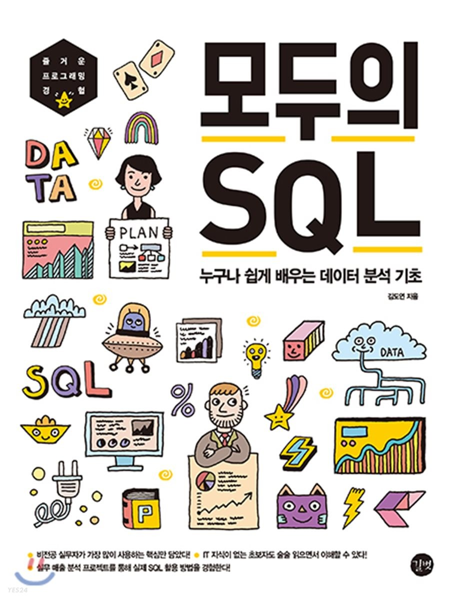

9월부터 회사와 숭실대와 맺은 산학연계교육이 시작된다.
나는 디지털 기획 전문가 과정을 듣게 되었는데 오늘 개강 2주쯤 앞두고 사전자기주도학습 안내를 받았다.

크게 마케팅, UI/UX, Python, SQL을 공부할 것...같다.

마케팅과 UI/UX는 사전지식이 좀 부족해도... 수업 들으면서 따라가는게 어느정도는 가능해 보이는데

Python과 SQL은 기본적인 공부는 해둬야 따라잡을 수 있지 않을까;; 싶다.
슬슬 열공해야겠구만....

